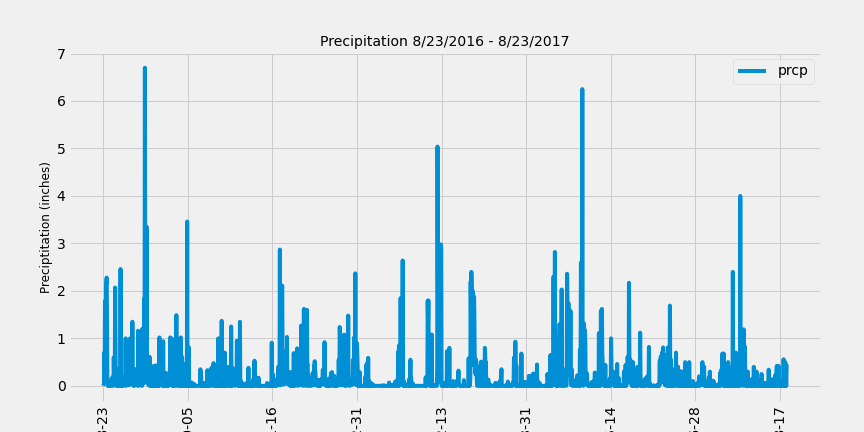
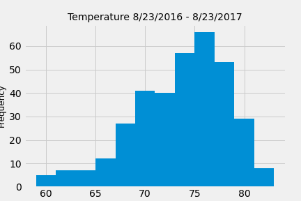

# SQLAlchemy Homework - Surfs Up!

## Project Overview
This project is a climate analysis and data exploration of the climate database. Python and SQLAlchemy were used to do basic climate analysis and data exploration of the climate database using SQLAlchemy ORM queries, Pandas, and Matplotlib.

Languages and libraries used:

* Pandas
* Numpy
* Matplotlib
* SQLAlchemy
* DateTime

---

## Climate Analysis and Exploration

### Data Preparation

* Jupyter notebook, `climate.ipynb` and [hawaii.sqlite](Resources/hawaii.sqlite) files were used to complete the climate analysis and data exploration.

* SQLAlchemy `create_engine` connects to the sqlite database.

* SQLAlchemy `automap_base()` reflects the tables into classes and saves a reference to those classes called `Station` and `Measurement`.

* Linked Python to the database by creating an SQLAlchemy session.

### Precipitation Analysis

* Find the most recent date in the data set.

  * Most recent date: 2017, 08, 23

* Using this date, retrieves the last 12 months of precipitation data by querying the 12 preceding months of data. 

  * Select only the `date` and `prcp` values.

* Loaded the query results into a Pandas DataFrame and set the index to the date column.

* Sorted the DataFrame values by `date`.

* Plottec the results using the DataFrame `plot` method.

  

* Used Pandas to print the summary statistics for the precipitation data.

  count	2021.000000 
  mean	0.177279 
  std	  0.461190 
  min	  0.000000 
  25%	  0.000000 
  50%	  0.020000 
  75%	  0.130000 
  max	  6.700000  

### Station Analysis

* Query to calculate the total number of stations in the dataset.

* Query to find the most active stations.

  * Listed the stations and observation counts in descending order.

  * Determinied wich station id has the highest number of observations.
    * Station with most observations: USC00519281

  * Using the most active station id, calculated the lowest, highest, and average temperature.

    count	352.000000  
    mean	73.107955  
    std	4.733315  
    min	59.000000  
    25%	70.000000  
    50%	74.000000  
    75%	77.000000  
    max	83.000000  

* Query to retrieve the last 12 months of temperature observation data (TOBS).

  * Filtered by the station with the highest number of observations.

  * Queried the last 12 months of temperature observation data for this station.

  * Plotted the results as a histogram with `bins=12`.

  

- - -

## Climate App

Designed a Flask API based on the previously developed queries.

* Used Flask to create routes.

### Routes

* `/` Home page

  * Available Hawaii API Routes:

      * /api/v1.0/precipitation 
      * /api/v1.0/stations 
      * /api/v1.0/tobs 
      * /api/v1.0/&lt;start&gt; 
      * /api/v1.0/&lt;start&gt;/&lt;end&gt;

 * `/api/v1.0/stations` 
 
    * Converted the query results to a dictionary using `date` as the key and `prcp` as the value.

    * Returned the JSON representation of the dictionary.

* `/api/v1.0/stations`

  * Returned a JSON list of stations from the dataset.

* `/api/v1.0/tobs`
  
  * Queried the dates and temperature observations of the most active station for the last year of data.

  * Returned a JSON list of temperature observations (TOBS) for the previous year.

* `/api/v1.0/<start>` and `/api/v1.0/<start>/<end>`

  * Returned a JSON list of the minimum temperature, the average temperature, and the max temperature for a given start or start-end range.

    * With the start only, calculated `TMIN`, `TAVG`, and `TMAX` for all dates greater than and equal to the start date.

    * With the start and the end date, calculated the `TMIN`, `TAVG`, and `TMAX` for dates between the start and end date inclusive.

- - -

## Temperature Analysis I

Determined if there is a meaningful difference between the temperature in June and December in Hawaii.

* Identified the average temperature in June and December at all stations across all available years in the dataset.

  * June: 74.94411764705882
  * December: 71.04152933421226

* An independent t-test was performed to determine whether the difference in the means, if any, is statistically significant. 

  * Ttest_indResult(statistic=31.60372399000329, pvalue=3.9025129038616655e-191)
  
  * Null Hypothesis: Temperatures in Hawaii in June and December have no statistically significant difference.

  * Reject the Null Hypothesis

  * There is a statistically significant difference in the temperatures in June and December in Hawaii.

- - -

## Temperature Analysis II

* Used historical data in the dataset find out what the temperature had previously looked like.

* Used the `calc_temps` function to calculate the min, avg, and max temperatures for the trip using the matching dates from a previous year.

* Plotted the min, avg, and max temperature as a bar chart.

  * Used the average temperature as the bar height (y value).

  * Used the peak-to-peak (TMAX-TMIN) value as the y error bar (YERR).

    

### Daily Rainfall Average

* Used historical data in the dataset to find out what the precipitation had previously looked like

  * Calculated the rainfall per weather station using the previous year's dates (i.e. "2017-08-01").

    * Sorted  in descending order by precipitation amount and list the station, name, latitude, longitude, and elevation.

### Daily Temperature Range and Average

* Calculated the daily normals. Normals are the averages for the min, avg, and max. 

  * Set the start and end date of the trip.

    * Used the date to create a range of dates.

  * Removed the year and saved a list of strings in the format `%m-%d`.

  * Use the `daily_normals` function to calculate the normals for each date string and append the results to a list.

* Loaded the list of daily normals into a Pandas DataFrame and set the index equal to the date.

* Used Pandas to plot an area plot for the daily normals.

 

